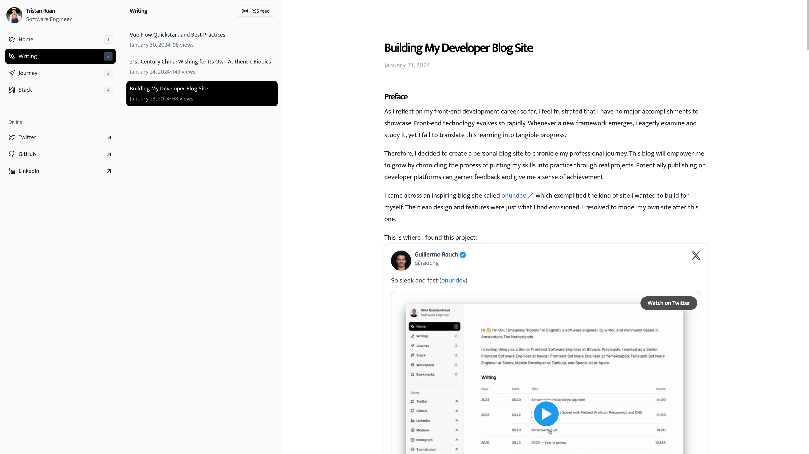
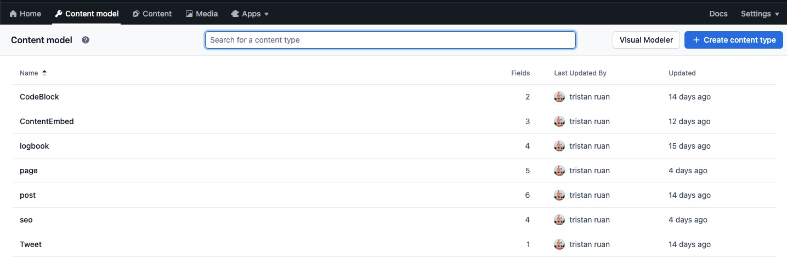

# monsterpi13.dev



This is the code for my personal blog site at [https://www.monsterpi13.dev](https://www.monsterpi13.dev), forked from
[onur.dev](https://github.com/suyalcinkaya/onur.dev) 🍴.

## Introduction

I created this blog to chronicle my journey as a front-end developer. The goals are:

- Showcase what I'm learning and working on 📚
- Gain experience building a real-world project ⚒️
- Get feedback from the dev community 👥

The clean design and features of [onur.dev](https://onur.dev/) exemplified the kind of blog I wanted to build for
myself. So I decided to fork it and customize for my own use. 🤓

## Tech Stack

- Framework: [Next.js](https://nextjs.org/)
- Styling: [Tailwind CSS](https://tailwindcss.com/) + [shadcn/ui](https://ui.shadcn.com/)
- Database: [Supabase](https://supabase.com/)
- CMS: [Contentful](https://www.contentful.com/)
- Deployment: [Vercel](https://vercel.com/) ⚡️

## Key Features

- SEO Optimization - implements generateMetadata to boost SEO 📈
- Static Generation - generates static pages at build time for better performance ⚡️
- Draft Previews - preview unpublished posts during development 🖊️
- Caching - intelligently caches and revalidates pages 💾
- Realtime - shows realtime post view count using Supabase 🔴

And more - see the [blog](https://dev.to/monsterpi13/building-my-developer-blog-site-2jee) posts for details.

## Getting Started

### Prerequisites

- Node.js and pnpm

### Installation

```bash
# Clone the repository
git clone https://github.com/MonsterPi13/monsterpi13.dev.git

# Install dependencies
pnpm install

# Configure environment variables
# See .env.example file

# Run the dev server
pnpm run dev
```

### Configuration

1. Create Contentful space
2. Create Supabase project
3. Add API keys to .env
4. Import content model
5. Populate space

### Contentful model



1. Inline entry(Which will be as inline entry inserted into the rich text, like `post`)

- CodeBlock

  - title `Short Text`
  - code `Long Text`

- ContentEmbed

  - title `Short Text`
  - embedUrl `Short Text`
  - type `Short Text`(Accept only specified values)
    - Video
    - SoundCloud

- Tweet
  - id `Short Text` (Tweet id)

2. logbook - for the content of the `/journey`

- title `Short Text`
- date `Date&Time`
- description `Long Text`
- image `Media`

3. post - For the content of the `/writing/[slug]`

- title `Short Text`
- description `Short Text`
- slug `Short Text`
- date `Date&time`
- content `Rich Text`
- seo `Reference`

4. page - For dynamic routes, like `/writing`, `/stack`

- title Short Text
- content Rich Text
- slug Short Text
- hasCustomPage Boolean
- seo Reference

5. seo - Reusable SEO, will be related with the extra content type

- title Short Text
- description Short Text
- ogImageTitle Short Text
- ogImageSubtitle Short Text

### Deployment

The site can be easily deployed on Vercel, Netlify, etc:

1. Connect repo
2. Configure environment variables
3. Trigger deploy

### Contributing

Contributions are welcome! Please feel free to open issues and pull requests.
